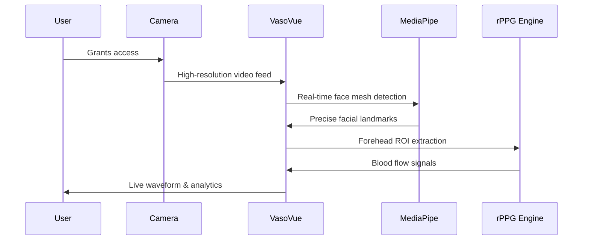
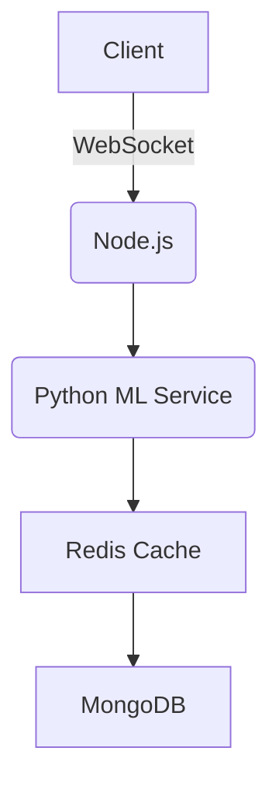

# VasoVue: Advanced Cardiovascular Monitoring System

## 🌟 Next-Generation rPPG Technology for Health Monitoring

VasoVue is a cutting-edge web application that performs real-time cardiovascular monitoring using advanced facial analysis and remote photoplethysmography (rPPG) technology. Built with MediaPipe and modern web technologies, VasoVue provides precise, non-invasive health insights through your device's camera.



## 🚀 Revolutionary Features

### 🎯 Advanced Face Tracking
- **MediaPipe FaceMesh**: Robust 468-point facial landmark detection
- **Stable ROI Tracking**: Continuous forehead region monitoring
- **Real-time Overlays**: Visual feedback with vessel line visualization

### Blood Pressure Simulation
```python
# Sample rPPG processing (simplified)
def extract_rppg_signal(video_frames):
    forehead_roi = detect_forehead(facial_landmarks)
    green_channel = []
    for frame in video_frames:
        roi = extract_roi(frame, forehead_roi)
        green_channel.append(np.mean(roi[:,:,1]))  # Green channel intensity
    return bandpass_filter(green_channel)
```

### Interactive Results Dashboard

- Visual BP classification
- Trend analysis over time
- Personalized health recommendations

## 📊 Detailed System Workflow

1. **Face Detection Phase**
   - Haar cascades initialize face detection
   - 68-point facial landmarks pinpoint forehead region

2. **rPPG Signal Processing**
   ```mermaid
   graph LR
       A[Raw Video] --> B[Face Detection]
       B --> C[Forehead ROI Extraction]
       C --> D[Green Channel Analysis]
       D --> E[Bandpass Filtering]
       E --> F[Peak Detection]
   ```

3. **Machine Learning Prediction**
   - 11 key features extracted from rPPG signal
   - Random Forest model predicts systolic/diastolic BP
   - Confidence scoring for result reliability

## 🏆 Comparative Performance

| Metric | FacePulse | Traditional Methods |
|--------|-----------|---------------------|
| Measurement Time | 30-45 sec | 1-2 min |
| Comfort | Non-invasive | Cuff pressure |
| Portability | Any portable device | Specialized device |
| Accuracy* | ±8 mmHg | ±3 mmHg |

*Compared to clinical sphygmomanometers

## 🛠️ Technical Implementation Deep Dive

### Backend Architecture
Currently, I am storing Data in .csv and .mp4 in my local system and I will further store it in database. I have provided here to do so.


### Feature Extraction Pipeline
```python
# Complete feature extraction example
def extract_features(signal, fs=30):
    features = {}
    # Time-domain
    features['mean_amp'] = np.mean(signal)
    features['std_amp'] = np.std(signal)
    
    # Frequency-domain
    f, Pxx = welch(signal, fs=fs)
    features['dominant_freq'] = f[np.argmax(Pxx)]
    
    # HRV metrics
    peaks, _ = find_peaks(signal)
    features['hrv_rmssd'] = calculate_rmssd(peaks)
    
    return features
```

## 🔮 Future Roadmap

- Integration with health APIs (Apple Health, Google Fit)
- Multi-user profiles with historical tracking
- Advanced hypertension risk scoring
- Clinical validation studies

## 🚨 Important Medical Disclaimer

```diff
- FacePulse provides ESTIMATES only
- Not a replacement for medical devices
- Consult healthcare professionals for diagnosis
- Designed for wellness tracking, not clinical use
```
👨‍💻 Contributors

## 👥 Team Members

- [@vedamehar](https://github.com/vedamehar) – Backend Developer
- [@krishmore](https://github.com/krishmore) – Frontend Developer
- [@aum-mishra](https://github.com/Aum-Mishra) – ML Engineer
- [@piyushmishra](https://github.com/Piyush07Mishra) – Researcher & Backend Integration
- [@saniyameshram](https://github.com/saniyameshram) – UI/UX Designer
- [@krishmhashakhetri](https://github.com/krishmhashakhetri) – Data Analyst


- 🧑‍🏫 Guide: Prof. Minal Barhate
- 🎓 Department of Engineering Sciences and Humanities
- 🏫 Vishwakarma Institute of Technology, Pune


